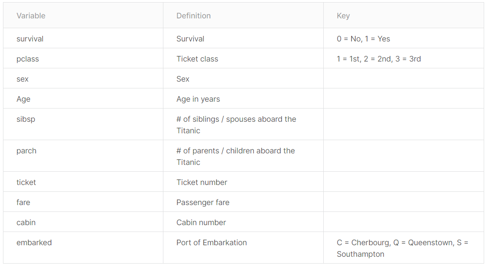
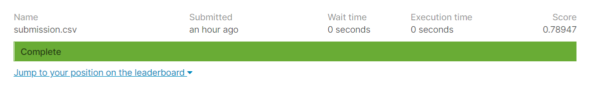
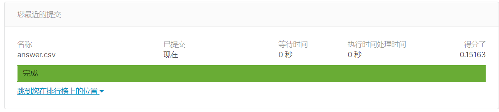
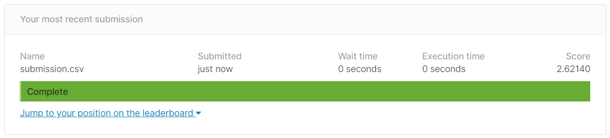
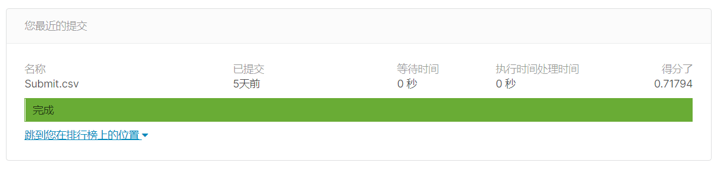

# kaggle竞赛项目
## 1.Titanic Machine Learning from Disaster
### 1. 预测目标
通过每位乘客的特征值，来预测其是否能从泰坦尼克号事故中存活下来，目标值1代表存活，0代表不存活。竞赛官网为<https://www.kaggle.com/c/titanic/overview>。
### 2. 特征描述

### 3. 数据集概览
从官网下载下来的数据集包含三个CSV文件：train.csv,test.csv,gender_submission.csv。train.csv就是我们用来训练模型的数据，test.csv就是预测的测试集，预测结果最后提交给官网可以看到得分情况，gender_submission.csv是一个提交文件案例，我们提交的文件要按与其一样的格式提交。
### 4. 特征工程
处理逻辑为：  

- PassengerId特征去掉  
- Survived是要预测的目标值  
- Pclass转为one_hot编码  
- Name提取出每个人的姓名前缀，比如Mr,Miss等。然后将提取出来的前缀转为one_hot编码  
- Sex转为one_hot编码  
- Age原数据保留，还要根据原数据创造新的分箱数据，作为新的特征
- SibSp数据保留  
- Parch数据保留  
- 将SibSp数据和Parch数据加和创造新的数据，作为新的特征  
- 将SibSp数据和Parch数据加和是否为0，创造新的数据，作为新的特征  
- Ticket可能包含信息，但唯一值太多了，所以要转化为将其切割空白符后得到的长度大小作为新的特征值，然后新的特征转为one_hot编码  
- Fare数据保留  
- Cabin缺失值太多，所以去掉  
- Embarked转为one_hot编码  
**具体处理过程可见`Titanic Machine Learning from Disaster.ipynb`**。
### 5. 模型构建
在构建模型之前，还将训练数据与测试数据进行增加交互项特征，标准化处理。  
建立了随机森林和支持向量机的交叉验证模型，最后选择了随机森林的交叉验证模型进行预测。  
### 6. 提交结果  
  

## 2.House Prices  Advanced Regression Techniques
### 1. 预测目标
通过每个房屋的特征值，来预测每个房屋的最终价格。竞赛官网为<https://www.kaggle.com/c/house-prices-advanced-regression-techniques/overview>。  
### 2. 特征描述
除了预测目标，每个房屋包含79个特征，因为特征数量太多，就不一一描述了。
### 3. 数据集概览
从官网下载下来的数据集包含三个CSV文件：train.csv,test.csv,sample_submission.csv,data_description.txt。train.csv就是我们用来训练模型的数据，test.csv就是预测的测试集，预测结果最后提交给官网可以看到得分情况，sample_submission.csv是一个提交文件案例，我们提交的文件要按与其一样的格式提交。data_description.txt是关于每个特征的具体描述。  
### 4. 特征工程
处理逻辑为：  

- 首先填充缺失值，因为包含缺失值的特征很多，所以要一一处理  
- Alley包含缺失值太多，所以去掉这一列  
- Id列去掉  
- MasVnrType包含缺失值太多，所以去掉这一列  
- MasVnrArea包含缺失值太多，所以去掉这一列  
- 其他包含缺失值的分类特征，如果在data_description.txt文件中，关于这个特征的分类取值中有NA这个取值，就将其缺失值填充为NA。  
- 其他包含缺失值的int类型特征，将其缺失值填充为该列频率最大的值。  
- 最后对整体数据应用pandas中的get_dummies函数，将分类特征转换为one_hot编码。  
**具体处理过程可见`House Prices  Advanced Regression Techniques.ipynb`**。  
### 5. 模型构建
构建了包含SelectFromModel(RandomForestRegressor(n_estimators=10, max_depth=5)), PolynomialFeatures(), StandardScaler(),SGDRegressor()的管道模型，对其应用交叉验证进行训练，最后根据训练出来的模型进行预测。  
### 6. 提交结果  
  
因为是按均方根误差（RMSE）进行评估，所以分数越低，预测效果越好。
## 3.PUBG Finish Placement Prediction
### 1. 预测目标
通过每个玩家的游戏特征值，来预测每位玩家的最终排名，排名以百分比显示。竞赛官网为<https://www.kaggle.com/c/pubg-finish-placement-prediction/overview>。  
### 2. 特征描述
除了预测目标，每个玩家包含28个特征，因为特征数量太多，就不一一描述了。  
### 3. 数据集概览
从官网下载下来的数据集包含三个CSV文件：train.csv,test.csv,sample_submission.csv。train.csv就是我们用来训练模型的数据，test.csv就是预测的测试集，预测结果最后提交给官网可以看到得分情况，sample_submission.csv是一个提交文件案例，我们提交的文件要按与其一样的格式提交。  
### 4. 特征工程
处理逻辑为：  

- 根据groupId特征进行分组，计算组内包含组员的个数，为每个组员记录这个个数，通过transform函数实现  
- 根据matchId特征进行分组，计算组内包含组员的个数，为每个组员记录这个个数，通过transform函数实现  
- damageDealt存在异常值，通过clip函数确定该组数据的边界值  
- killPlace存在一个异常值101，将其替换为100  
- 对rankPoints值不等于-1，killPoints等于0的行，将其killPoints值设为np.nan,这一修改是根据官网数据描述而做的  
- longestKill存在异常值，通过clip函数确定该组数据的边界值  
- 对matchDuration列进行标准化  
- 创造新特征different，如果该行的maxPlace值不等于numGroups值，就将其different值设为1，否则设为0  
- 对rideDistance列进行标准化
- 对swimDistance列进行标准化
- 对walkDistance列进行标准化
- 对rankPoints值不等于-1，winPoints等于0的行，将其winPoints值设为np.nan,这一修改是根据官网数据描述而做的
- 填充killPoints列的缺失值为该列的频率最大值
- 填充winPoints列的缺失值为该列的频率最大值
- 填充rankPoints列的缺失值为该列的频率最大值
- 将matchType转为one_hot编码
- 删除Id,groupId, matchId这三列  
**具体处理过程可见`PUBG Finish Placement Prediction.ipynb`**。  
### 5. 模型构建
构建了岭回归模型进行训练，最后在测试集上预测获得了0.848的r2分数。  
## 4.TMDB Box Office Prediction
### 1. 预测目标
提供了7,000多部过去发行的电影的元数据，以尝试预测其全球总票房收入。提供的数据特征包括演员，剧组，剧情关键字，预算，海报，发行日期，语言，制作公司和国家等。竞赛官网为<https://www.kaggle.com/c/tmdb-box-office-prediction/overview>。  
### 2. 特征描述
除了预测目标，每个电影包含22个特征，因为特征数量太多，就不一一描述了。  
### 3. 数据集概览
从官网下载下来的数据集包含三个CSV文件：train.csv,test.csv,sample_submission.csv。train.csv就是我们用来训练模型的数据，test.csv就是预测的测试集，预测结果最后提交给官网可以看到得分情况，sample_submission.csv是一个提交文件案例，我们提交的文件要按与其一样的格式提交。  
### 4. 特征工程
处理逻辑为：  

- 创造新特征has_name，根据belongs_to_collection值是否是缺失值为其赋值  
- belongs_to_collection列包含的是字典型数据，所以将其中name字段的值提取出来覆盖原来的字典型数据。  
- 通过计数器函数对belongs_to_collection列的值进行技术，现在belongs_to_collection列中的值是name字段包含的名称，提取出频率最高的前30个名称，创造30个新特征，每个新特征代表一个频率前30的名称，根据belongs_to_collection列的值是否与新特征的名称是否相同为其赋值1或0
- genres列包含的也是字典型数据，提取出所有name字段的值，添加进列表覆盖原来的genres列值。统计新genres列值的所有唯一值，创造代表这些唯一值新特征，根据新genres列值是否包含某个唯一值赋予新特征1或0
- 根据overview值的空格分隔长度创造新特征overview_len
- 根据production_companies的值列表长度创造新特征production_companies_len
- 设计一个函数most_dummies，包含三个参数df, col, tag，df代表DataFrame数据，col是列名称，tag是col列中的字典数据某个键值。这个函数的作用是统计col列的字典数据tag键值包含的数据频率前30高的值，创造30个新特征，每个新特征代表一个频率前30的值，根据新特征值是否包含于col列的字典数据tag键值列表，为其赋值1或0
- 对production_companies列的name键值应用most_dummies函数
- 根据spoken_languages的值列表长度创造新特征spoken_languages_len
- 对spoken_languages列的iso_639_1键值应用most_dummies函数
- 根据production_countries的值列表长度创造新特征production_countries_len
- 对production_countries列的iso_3166_1键值应用most_dummies函数
- 根据tagline值的空格分隔长度创造新特征tagline_len
- 根据Keywords的值列表长度创造新特征Keywords_len
- 对Keywords列的name键值应用most_dummies函数
- 根据cast的值列表长度创造新特征cast_len
- 对cast列的name键值应用most_dummies函数
- 对cast列的character键值应用most_dummies函数
- 计算cast列中每个值包含的性别0、1、2的数量，分别作为新特征
- 根据crew的值列表长度创造新特征crew_len
- 对crew列的name键值应用most_dummies函数
- 对crew列的department键值应用most_dummies函数
- 对crew列的job键值应用most_dummies函数
- 计算crew列中每个值包含的性别0、1、2的数量，分别作为新特征
- 将budget列值为0的数值替换为budget列的中位数，并标准化budget列
- 根据homepage是否是缺失值创造新特征has_homepage，赋值1或0
- 根据original_title列值是否存在重复值创造新特征original_title_duplicated，赋值1或0
- 标准化popularity列 
- 根据poster_path是否是缺失值创造新特征has_poster_path，赋值1或0
- release_date列是日期型数据，查阅后发现一个缺失值，根据电影名称查到是2000年发行的电影，所以填充缺失值为'1/1/00'
- 将release_date列值按'/'进行切割，转换为列表
- 根据release_date第三个数值分组，创造三个新特征，代表在哪个年份区间段发表的电影
- 提取出release_date的月份信息，创造新特征release_month
- 填充runtime列的缺失值为该列的中位数，并将runtime列标准化
- 根据original_title与title值是否相同创造新特征same_titile，赋值1或0
- 填充status列的缺失值为该列频率最大的值
- 删除一些列，并将original_language、status、release_month这三列转换为one_hot编码

**具体处理过程可见`TMDB Box Office Prediction.ipynb`**。  
### 5. 模型构建
构建了随机森林回归器的交叉验证模型，最后根据训练出来的模型进行预测。  
### 6. 提交结果  
  
因为是按均方根对数误差（RMSLE）进行评估，所以分数越低，预测效果越好。
## 5.DonorsChoose.org Application Screening
### 1. 预测目标
帮助DonorsChoose.org筛选教师提交的为学生寻求物资或其他支持的项目申请，越策每个项目申请通过的概率，本质是个二分类任务，但是需要提交的是该项目通过的概率。竞赛官网为<https://www.kaggle.com/c/donorschoose-application-screening/overview>。  
### 2. 特征描述
因为特征数量太多，就不一一描述了。  
### 3. 数据集概览
从官网下载下来的数据集包含三个CSV文件：train.csv,test.csv,sample_submission.csv，resources.csv。train.csv就是我们用来训练模型的数据，test.csv就是预测的测试集，预测结果最后提交给官网可以看到得分情况，sample_submission.csv是一个提交文件案例，我们提交的文件要按与其一样的格式提交。resources.csv是附加的特征信息，是关于每个项目申请包括的申请资源的，所以需要将resouces中的表与train和test中的表合并。  
### 4. 特征工程
处理逻辑为：  

- 首先处理resources中的信息，将description列的值提取出前三个单词，缺失值填写为Unkown
- 根据description列的值是否为Unkown创造新特征no_description，赋值1或0  
- 通过计数器函数对description列的值进行计数，现在description列中的值是包含三个单词的字符串，提取出频率最高的前30个名称，创造30个新特征，每个新特征代表一个频率前30的名称，根据belongs_to_collection列的值是否与新特征的名称是否相同为其赋值1或0
- 根据price列的值是否为0创造新特征is_free，赋值1或0  
- 将quantity列与price列的值相乘，创造新特征spend
- 对resources表按id列进行分组，然后对分组数据应用agg函数，计算第四列之后的列的'sum值'，再加上description列的count值，quantity列的sum值，price列的mean值。然后得到新的DataFrame为res，将res的price列和spend列标准化
- 将train_df与test_df合并之后再与res合并，得到all_df，接下来对all_df进行处理
- 通过计数器函数对teacher_id列的值进行计数，提取出频率最高的前30个值，创造30个新特征，每个新特征代表一个频率前30的值，根据teacher_id列的值是否与新特征的值是否相同为其赋值1或0
- 填充teacher_prefix列的缺失值为该列的频率最大值
- 将teacher_prefix, school_state加入待转为one_hot编码的列表
- 将project_submitted_datetime列的类型转为datatime类型
- 提取project_submitted_datetime列的年份为新特征submitted_year
- 提取project_submitted_datetime列的月份为新特征submitted_month
- 将submitted_year, submitted_month，project_grade_category加入待转为one_hot编码的列表
- 将project_subject_categories列包含的类别名称提取出来放入列表中，统计这些类别的唯一值 
，根据这些唯一值创造新特征列，根据project_subject_categories列中的值是否包含某个新特征列的值赋值1或0  
- project_subject_subcategories做同样的处理，但是要把project_subject_subcategories列的唯一值去掉project_subject_categories列唯一值相交的成分
- 根据project_title列的单词长度创造新特征project_title_len
- 统计project_title列频率前30高的名称，根据这30个名称是否与project_title列中的值相同创造30个新特征，赋值1或0
- 根据project_essay_1列值的单词长度创造新特征project_essay_1_len
- 根据project_essay_2列值的单词长度创造新特征project_essay_2_len
- 根据project_essay_3列值的单词长度创造新特征project_essay_3_len
- 根据project_essay_4列值的单词长度创造新特征project_essay_4_len
- 将project_essay_1、project_essay_2、project_essay_3、project_essay_4列的字符串拼接起来创造新的特征project_essay
- 对project_title，project_essay，project_resource_summary列应用TfidfVectorizer，分别生成50，200，100个新特征
- 根据project_resource_summary列的单词长度创造新特征project_resource_summary_len
- 标准化teacher_number_of_previously_posted_projects列
- 删除一些列并将teacher_prefix,school_state,submitted_year,submitted_month,project_grade_category列转为One_hot编码  
**具体处理过程可见`DonorsChoose.org Application Screening.ipynb`**。  
### 5. 模型构建
构建了随机森林分类器的交叉验证模型，最后根据训练出来的模型进行预测，这里不使用predict函数，因为要预测通过概率，所以使用predict_proba函数。  
### 6. 提交结果  
  
